# Active Directory Lab – Windows Server & Windows 10

## Project Overview
The purpose of this project is to build a virtual Active Directory (AD) environment for hands-on learning in network and system administration. The lab involves **Windows Server 2016** as a Domain Controller and **Windows 10** clients, with a focus on configuring AD services, managing users and groups, applying Group Policies, and controlling file share permissions.

This project simulates a small enterprise environment and demonstrates practical skills in network configuration, user management, and domain-based security controls.

---

**Components Involved:**
- **Windows Server 2016** – AD Domain Controller (DC), DNS, DHCP  
- **Windows 10** – Client machine (joined to the AD domain)  
- **Internal Network (VirtualBox Host-Only)** – Simulated LAN for AD communication  
- **Group Policies (GPOs)** – Password policies, account lockout policies  
- **File Shares** – Controlled access based on AD groups  

---

## Conclusion
This lab demonstrates the creation and configuration of a **Windows Server 2019 Active Directory environment** with domain-joined Windows 10 clients.  

**Skills demonstrated:**
- AD DS installation and configuration  
- DNS and DHCP setup  
- User and group management  
- Group Policy application for security enforcement  
- Controlled access to file shares  

This project strengthened my practical skills in **Windows Server administration**, **enterprise networking**, and **security best practices**.

---

## Walkthrough & Screenshots

**Installing Windows Server 2016**

**Renaming the server to AD-SERVER**

**Configuring a static IP on the server**

**Installing Windows 10**

**Renaming windows 10 machine**

**Configuring a static IP for Windows 10 Machine**

---
**Installing Active Directory Domain Services (AD DS)**

---
**Promote Server to a Domain Controller**

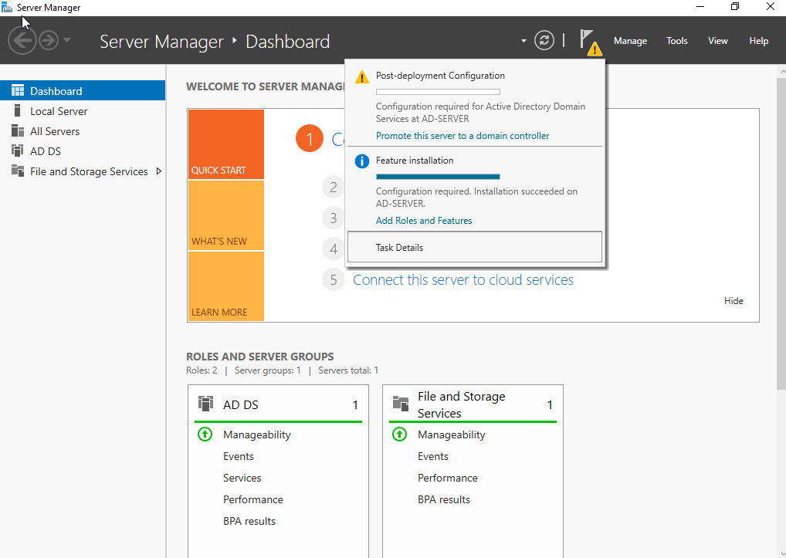
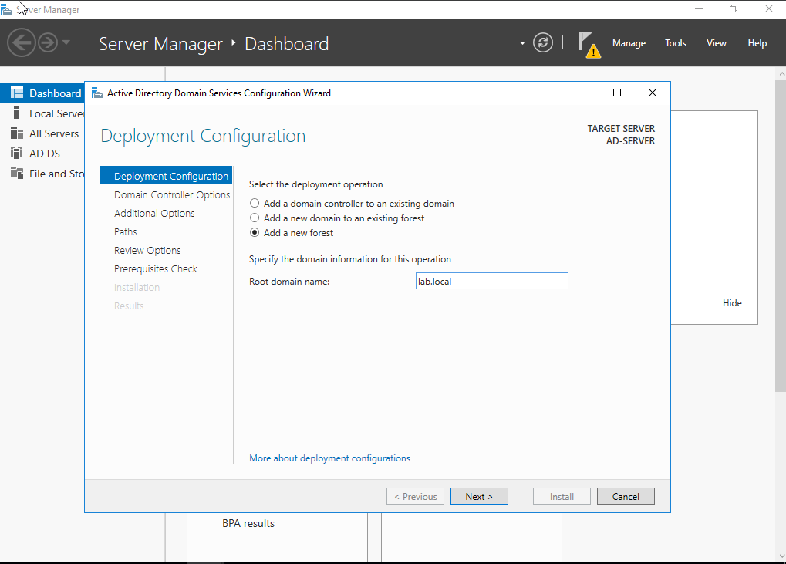
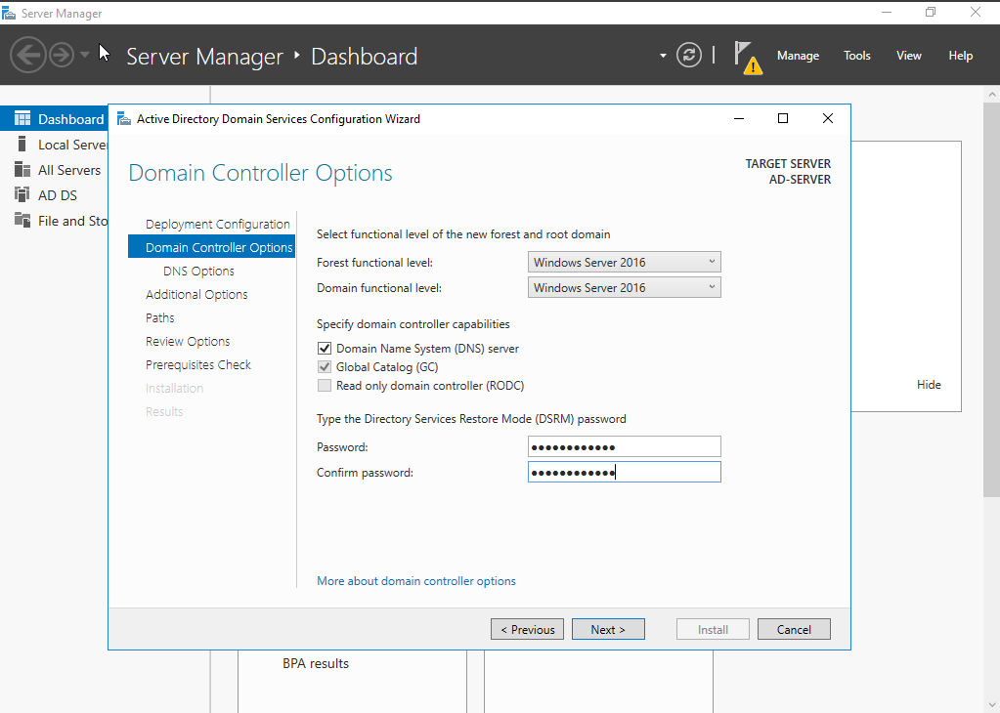
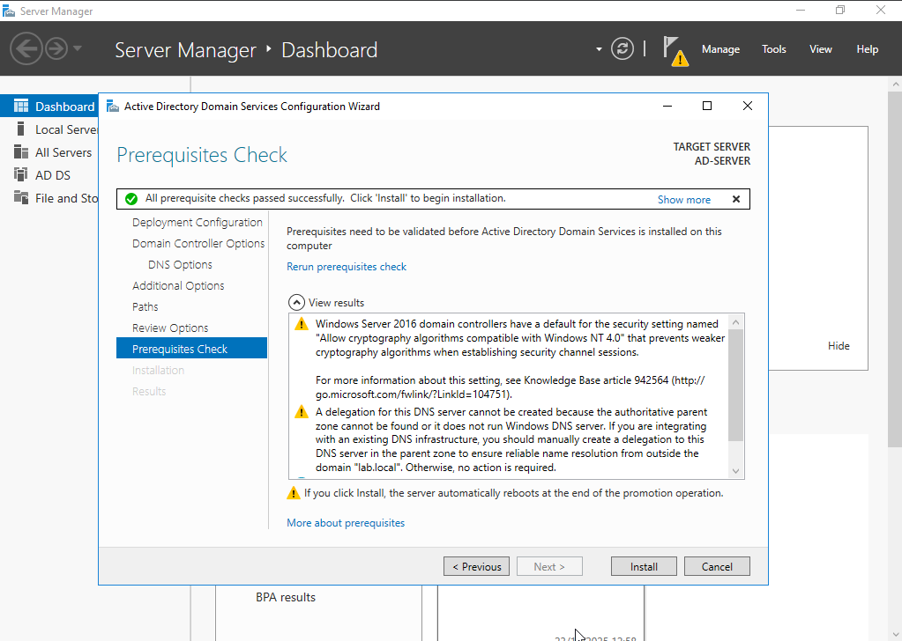

---
**Verify DNS is working**

DNS is critical. To check that it is working correctly I went to the command prompt typed in the command ipconfig /all and made sure that the preffered DNS = the server's own IP (192.168.1.10)
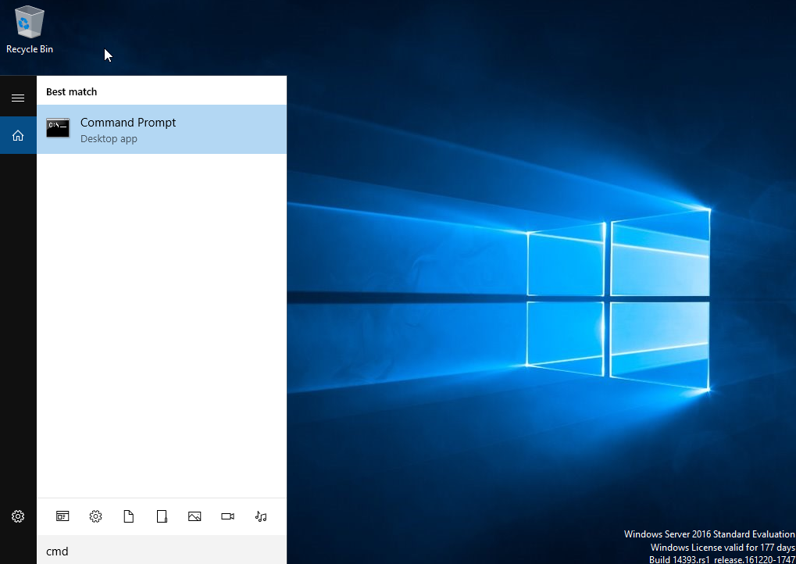
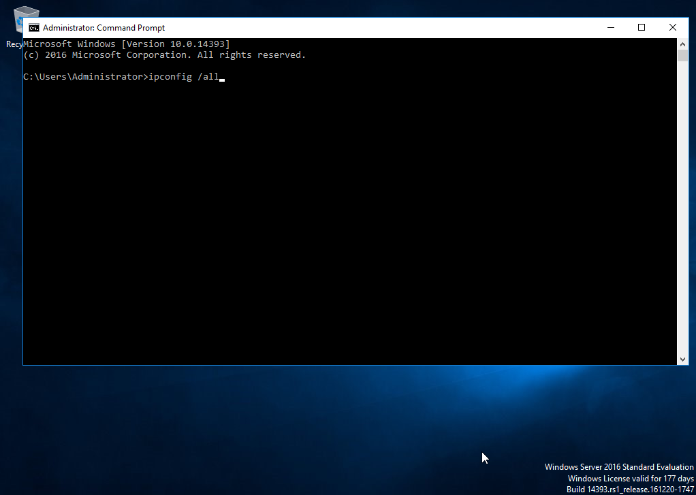
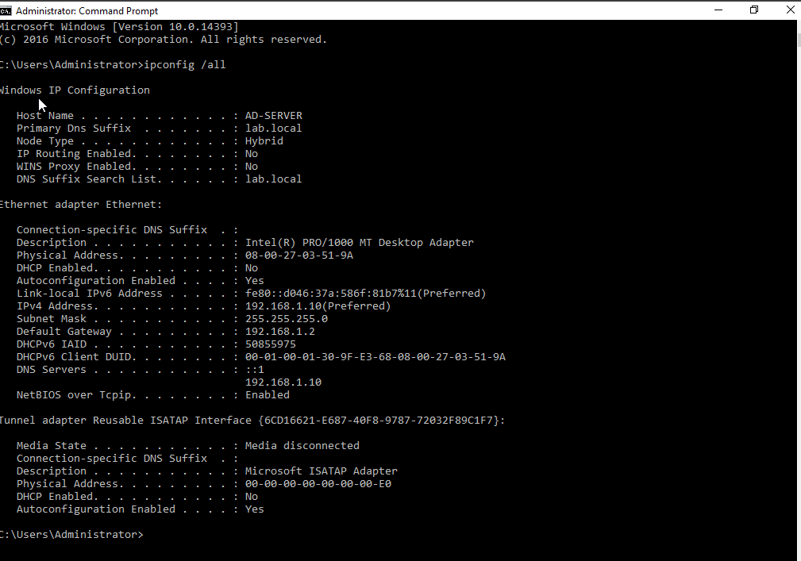

---
**Join the Windows 10 Machine to the Domain**

To do this, I went to System > Rename this PC (advanced). Then I clicked change, selected domain, entered the domain name (lab.local). Lastly I entered the domain admin credentials. The client then rebooted for changes to occur.

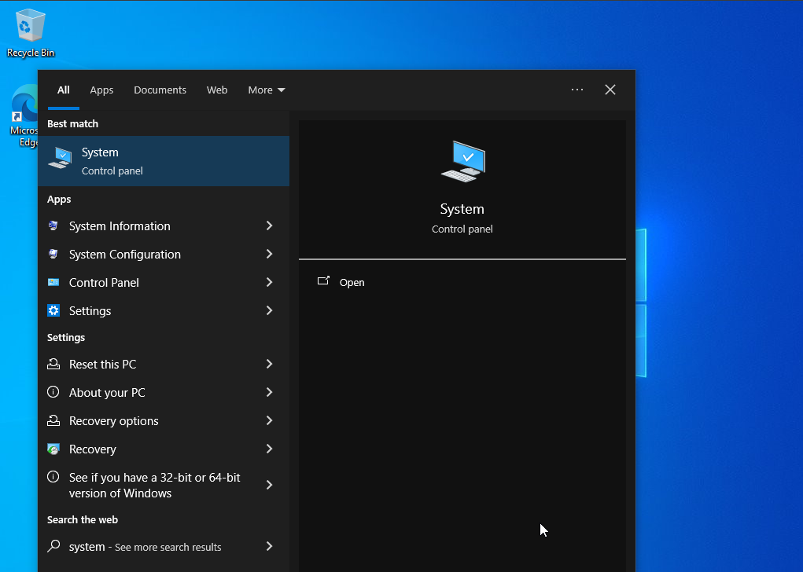
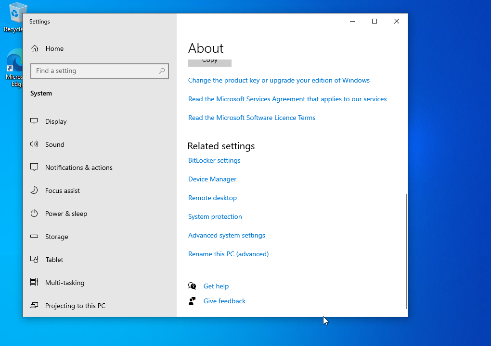
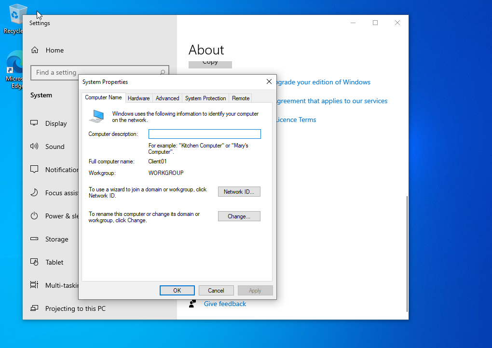
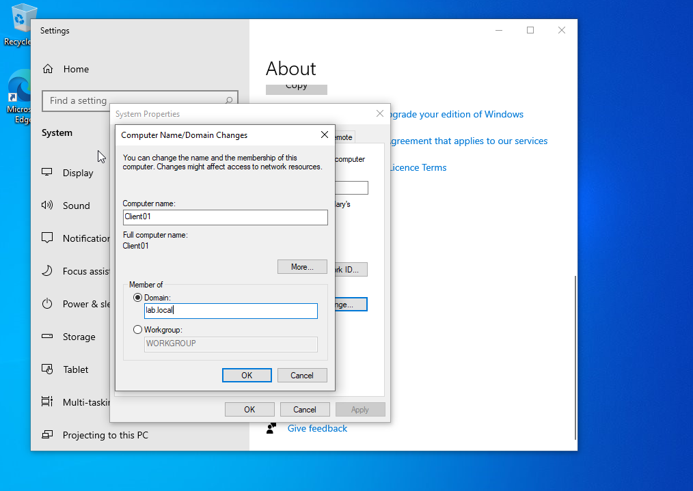
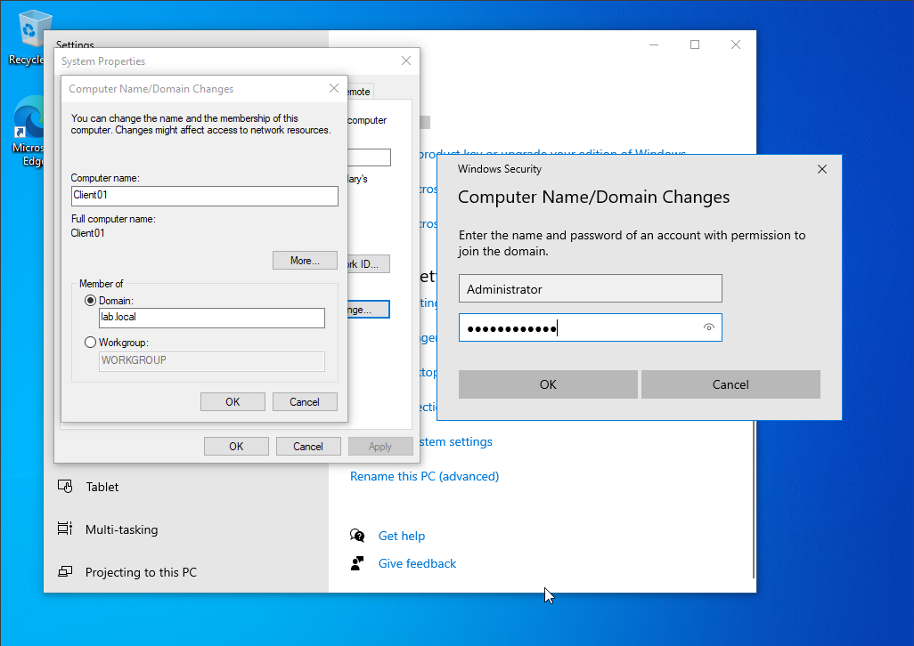

---

**Create AD Orginisational Unit (OU) structure**

**Moving The Windows 10 Machine into "Lab Computers"**

**Creating regular user accounts**

**Creating security groups**

**Adding users to their groups**

**Creating an Admin level user**

---

**Group Policies**

1. A baseline policy for all computers (password policies, firewall, Windows Update)
2. A user policy for standard users (desktop wallpaper, restrictions, drive mapping)
3. A server management policy (administrative tools unlocked for IT staff)

**Creating a Baseline GPO for All Domain Computers**

**Creating a GPO for Standard Users**

I first created the GPO by going to Start → Group Policy Management (gpmc.msc). Expand Forest → Domains → lab.local → Group Policy Objects. Right-click Group Policy Objects → New. Then I named the GPO "GPO - Standard User Experience"

Then I edited the GPO by first setting a Desktop wallpaper. User Configuration → Policies → Administrative Templates → Desktop → Desktop → Desktop Wallpaper. 

Set: Wallpaper Name: \\lab.local\SYSVOL\lab.local\scripts\wallpaper.jpg 

Wallpaper Style: Fill (or Fit)

Apply → OK.

Next I disabled control panel access. User Configuration → Administrative Templates → Control Panel → Prohibit access to Control Panel and Settings

Set to Enabled.

After that I hid tools by going to User Configuration → Administrative Templates → Start Menu and Taskbar.

I first enabled Remove Run menu from Start Menu

I then enabled prevent access to the command prompt

I then removed task manager

After this I set up drive mapping by going to User Configuration → Preferences → Windows Settings → Drive Maps.

Right-click → New → Mapped Drive

Set:

Action: Update

Location: \\lab-dc\Shared (you’ll create this folder in step 7)

Drive Letter: H:

Label: Shared Drive (optional)

Apply → OK.

Finally I linked the GPO to the Users OU.

**Creating a GPO for IT Admin Users**

Back in Group Policy Management:

Right-click Group Policy Objects → New

Then I named it "GPO - IT Admin Tools"

Next I edited the GPO to first enable admin tools by going to User Configuration → Administrative Templates → Control Panel → Control Panel: Prohibit access to Control Panel

Set to Disabled

I then enabled command prompt by navigating to User Configuration → Administrative Templates → System.

Prevent Access to Command Prompt → Disabled
Prevent access to registry editing tools → Disabled

Next I enabled PowerShell by going to User Configuration → Administrative Templates → Windows Components → Windows PowerShell.

Turn on Script Execution → Enabled
Allow all scripts 

Next I allowed Task Manager by going to User Configuration → Administrative Templates → System → Ctrl+Alt+Del Options.

Remove Task Manager → Disabled

Finally, I linked IT Admin GPO 

